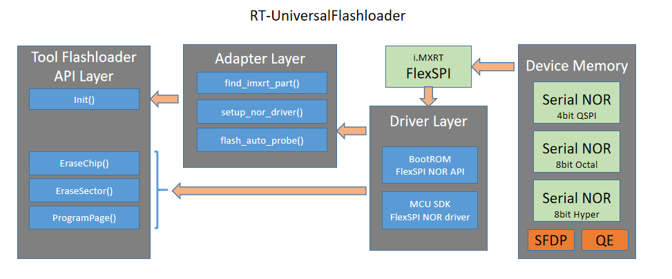

# RT-UFL (通用下载算法)

[](https://github.com/JayHeng/RT-UFL/releases/latest) [](https://github.com/JayHeng/RT-UFL/compare/v0.5...master)  [](https://github.com/JayHeng/RT-UFL/blob/master/LICENSE)

[English](./README-en.md) | 中文

## 一、简介

RT-UFL 是一个适用全平台i.MXRT的通用Flash下载算法项目，项目的最终目标是做到一个.FLM文件适用所有的i.MXRT开发板，且不论其连接的哪款Flash型号。

RT-UFL 主要是为了解决如下七大痛点：

```text
1. 每一个i.MXRT型号都需要一个单独的下载算法文件.
2. 同一个i.MXRT型号搭配不同属性的Flash也需要不同的算法文件.
3. 同一个i.MXRT型号搭配相同特性的Flash但Flash出厂设置不同（有无SFDP、QE默认状态灯）也需要不同的算法文件.
4. Flash连接到i.MXRT不同的FlexSPI引脚上也可能需要不同的算法文件.
5. 如果下载算法公共设计部分有不可忽视的缺陷，需要整体更新全部i.MXRT型号对应的下载算法.
6. 对于下载算法的发布，没有一个统一的版本管理.
7. 在量产过程中，如果更换了Flash型号，则需要对应更换算法文件，对于工厂流程来说有点麻烦.
```

RT-UFL 从设计上分为三层：

> * 最底层是Driver层：即Low-level驱动，对于i.MXRT来说，就是FlexSPI模块的驱动。
> * 中间是Adapter层：这一层是最核心的，它实现了全i.MXRT平台、全Flash型号的自适应支持。
> * 最顶层是API层：这属于下载算法模板，其实由集成开发环境(Keil、JLink)决定了，不可更改。



## 二、特性

为了使 RT-UFL 成为一个超级下载算法，它至少要包含如下八个特性：

```text
1. 可以跑在所有i.MXRT型号下.
2. 可以支持能用作i.MXRT可启动设备的所有类型Flash.
3. 可以擦写连在i.MXRT可启动FleXSPI引脚上的Flash.
4. 可以自动识别连接的Flash类型(QuadSPI, Octal-SPI, Hyperbus).
5. 可以自动检测Flash中有无SFDP及其版本.
6. 可以支持不含SFDP表的Flash.
7. 可以自动识别Flash的默认QE状态并开启QE.
8. 可以输出一些有效的Flash信息以便后续启动.
```


